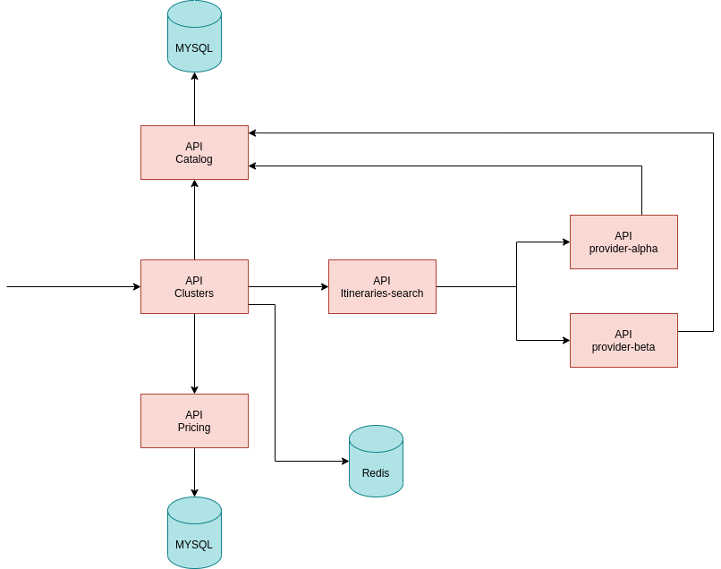
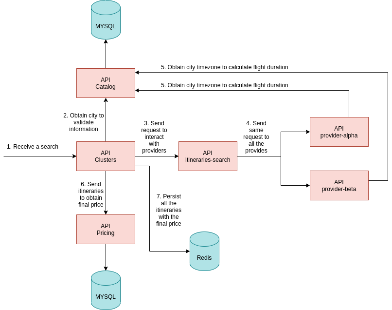

# Manning TWA - Optimizing Cost
 

This project contains all the code related with the live series of "Optimize costs in Microservices".

## Table of contents
The following are the most important topics in this file:
- [Requirements](#Requirements)
- [Architecture](#Architecture)
  - [Microservices](#Microservices)
  - [Model](#Model)
  - [Flow](#Flow)
- [Run the APIs](#run-the-apis)
- [Documentation of APIs](#documentation-of-apis)
- [Considerations](#Considerations)

## Requirements
To use these microservices you need to have in your machine the following things:
- [Java 11](https://www.oracle.com/ar/java/technologies/javase-jdk11-downloads.html)
- [Maven](https://maven.apache.org/)
- [Git](https://git-scm.com/)
- [Docker](https://www.docker.com/)

## Architecture
The microservices are an abstraction of all the possible flow of the flight's team. These microservices only contain all endpoints related with do a search. 

#### Microservices
The system consists of the following microserices:

* **api-catalog** - a microservice contaning all information about which are the valid cities to find flights. This API only returns a certain amount of flights that are required in the request, to obtain the next page of results without doing a new search all the results will save it in a database with a TTL. 
* **api-clusters** - a microservice contaning all the validations about the parameters of the search. Also call to **api-pricing** to obtain the final price of each itinerary.
* **api-pricing** - a microservice contaning all the rules to add markup of each itinerary and calculate the final price of each of them.
* **api-itineraries-search** - a microservices contaning all logic of which provider need to call to obtain all the possible itineraries. Also this microservice remove the possible duplicates.
* **api-provider-alpha** - a microservice which simulate to obtain the information of an external provider.
* **api-provider-beta** - a microservice which simulate to obtain the information of an external provider.

The following picture illustrates the architecture described above.

#### Model
Most of the microservices uses a common model of classes, to prevent duplicate code in each of them exists a library [Flights Common DTO](https://github.com/andres-sacco/manning-twa-libs-dto).

The common model consists of the following group of classes/enums:

* **AvailabilityRequestDTO** - This class contain all the parameters uses to do a search.
* **Provider** - This enum contain all the possible providers (Alpha, Beta).
* **FlightType** - This enum contain all the possible types of flights (One-way, Return). 
* **PassengerType** - This enum contain all the types of passengers.
* **ItineraryDTO** & **SegmentDTO**  & **LegDTO** - These classes have all the common information about one group of flights. Also contain a reference to the price.
* **PriceInfoDTO** - This class contain all the information about the price of all the type of passengers.
* **PaxPriceDTO** - This class refer to the price of one type of passenger.
* **MarkupDTO** - This class have all the information about the markup of one itinerary. 

#### Flow
The flow of each request to do a search have the following steps:
1. API-Clusters receive a request and validate common information like the number of passengers and the distribution of them, the departure date and some other information.
2. API-Clusters do a request of each city to validate the existence of that city.
3. API-Clusters do a request with all the information related with the search to API-Itineraries-search. 
4. API-Itineraries-search find all the possible providers and do a request with the same information that receive it.
5. Each provider obtain all the itineraries that match with the conditions of the request. Also each provider do a number of request to obtain the timezone of each city and with this information calculate the duration of each flight.
6. API-Clusters send all the itineraries to API-Pricing to obtain all the information about the markup of each flight and which is the final price.
7. API-Clusters save the entire responses for a very short period of time in the Redis database because the search is paginated, so API-Clusters use the database to prevent do the same search again just to obtain the next page the result.

The following picture illustrates the flow described above.

## Run the APIs
In order to run API, please follow these steps:
- Clone the repository using this command **git clone https://github.com/andres-sacco/manning-twa-api.git**
- Open a terminal in the directory of the API and run **mvn clean install** , this command compile all the code and generate the jars. After do that, run **docker-compose build** and  **docker-compose up** all the components run together.
- If everything works fine, open a web browser in the URL which appears in the documentation section.

Other option is open each project in the IDE (Eclipse, IntelliJ) and run it. Take in consideration that the repository have a file **docker-compose-infrastructure.yml** which have the containers to run the databases that **Catalog** and **Pricing** uses to obtain the information, so compile and run this file before run all the microservices in your IDE.

## Documentation of APIs
Each API have documentation to understand which parameters are required and the URL to invoke it. To see the API documentation is necessary to run the each project and access to:
- [Swagger - Clusters](http://localhost:4070/api/flights/clusters/documentation)
- [Swagger - Pricing](http://localhost:5070/api/flights/pricing/documentation)
- [Swagger - Catalog](http://localhost:6070/api/flights/catalog/documentation)
- [Swagger - Itineraries Search](http://localhost:7070/api/flights/itineraries-search/documentation)
- [Swagger - Provider Alpha](http://localhost:8070/api/flights/provider/alpha/documentation)
- [Swagger - Provider Beta](http://localhost:9070/api/flights/provider/beta/documentation)

Optionally you can use **Postman** or **Insomia** to do the request from the different microservices, the repository include a collection of each tool with all the endpoints.

## Considerations
To run all the microservices in the same machine you need to consider that the following ports need to be available to use it:

| Name                    | Application   | Database    |
| -----------             | -----------   | ----------- |
| API-Clusters            | 4070          | 6079        |
| API-Pricing             | 5070          | 3010        |
| API-Catalog             | 6070          | 3011        |
| API-Itineraries Search  | 7070          | ---         |
| API-Provider Alpha      | 8070          | ---         |
| API-Provider Beta       | 9070          | ---         |

Take into consideration that the port of the databases is only necessary when you run all the microservices in your IDE and use **docker-compose-infrastructure.yml** to run the databases. If you run all microservices using **docker-compose.yml** you only need to check the ports of **Application** column.

